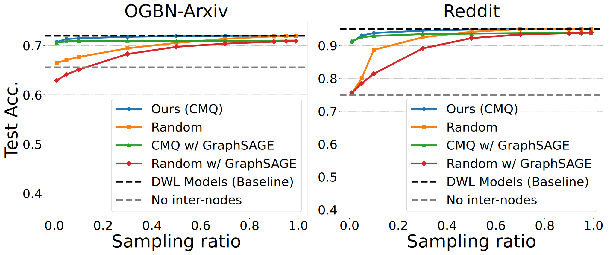

# Experiment customization
### Centroid (Sampling) Ratio vs. Accuracy: Fig.15

```bash
# Ours (CMQ) - Sampling ratio 1%
python -m BingoGCN.graph_partitioning.main \
    --dataset ogbn-arxiv \
    --inter_cluster \
    --outgoing_kmeans \
    --hierarchical_kmeans \
    --fixed_centroid_ratio \
    --centroid_ratio 0.01 \
    --pretrained_log BingoGCN/pretrained_logs/SLT_structured_Dense_baseline/GCN/ogbn-arxiv/SLT_structured_Dense_baseline_GCN_HD192_ogbn-arxiv_L4_S0.log

# Random - Sampling ratio 1%
python -m BingoGCN.graph_partitioning.main \
    --dataset ogbn-arxiv \
    --inter_cluster \
    --random_sampling \
    --inter_sparsity 0.99 \
    --pretrained_log BingoGCN/pretrained_logs/SLT_structured_Dense_baseline/GCN/ogbn-arxiv/SLT_structured_Dense_baseline_GCN_HD192_ogbn-arxiv_L4_S0.log
```

### Num of Partitions vs. CMQ's Accuracy with fixed centroid ratio at 1%: Fig.16

```bash
# Ours (CMQ) - #parts=64:
python -m BingoGCN.graph_partitioning.main \
    --dataset ogbn-arxiv \
    --n_parts 64 \
    --validate \
    --inter_cluster \
    --outgoing_kmeans \
    --hierarchical_kmeans \
    --fixed_centroid_ratio \
    --centroid_ratio 0.01 \
    --pretrained_log BingoGCN/pretrained_logs/SLT_structured_Dense_baseline/GCN/ogbn-arxiv/SLT_structured_Dense_baseline_GCN_HD192_ogbn-arxiv_L4_S0.log

# No border nodes - #parts=64:
python -m BingoGCN.graph_partitioning.main \
    --dataset ogbn-arxiv \
    --n_parts 64 \
    --validate \
    --no_inter_cluster \
    --pretrained_log BingoGCN/pretrained_logs/SLT_structured_Dense_baseline/GCN/ogbn-arxiv/SLT_structured_Dense_baseline_GCN_HD192_ogbn-arxiv_L4_S0.log
```

### Traditional offline K-means vs. CMQ: Fig.17

```bash
# Offline K-means - #Centroids=64:
python -m BingoGCN.graph_partitioning.main \
    --dataset ogbn-arxiv \
    --n_parts 8 \
    --inter_cluster \
    --outgoing_kmeans \
    --num_kmeans_clusters 64\
    --pretrained_log BingoGCN/pretrained_logs/SLT_structured_Dense_baseline/GCN/ogbn-arxiv/SLT_structured_Dense_baseline_GCN_HD192_ogbn-arxiv_L4_S0.log

# CMQ (only online) - #Centroids=64:
python -m BingoGCN.graph_partitioning.main \
    --dataset ogbn-arxiv \
    --n_parts 8 \
    --inter_cluster \
    --outgoing_kmeans \
    --online_kmeans \
    --num_kmeans_clusters 64 \
    --pretrained_log BingoGCN/pretrained_logs/SLT_structured_Dense_baseline/GCN/ogbn-arxiv/SLT_structured_Dense_baseline_GCN_HD192_ogbn-arxiv_L4_S0.log

# CMQ (online = hierarchical) - #Centroids=64:
python -m BingoGCN.graph_partitioning.main \
    --dataset ogbn-arxiv \
    --n_parts 8 \
    --inter_cluster \
    --outgoing_kmeans \
    --hierarchical_kmeans \
    --num_kmeans_clusters 64 \
    --pretrained_log BingoGCN/pretrained_logs/SLT_structured_Dense_baseline/GCN/ogbn-arxiv/SLT_structured_Dense_baseline_GCN_HD192_ogbn-arxiv_L4_S0.log
```

### Weight Capacity vs. Accuracy: Fig.18

```bash
# FG Sparsity with SLT - #dim_hidden=192:
python ./BingoGCN/main.py \
    --command train \
    --num_layers 3 \
    --dim_hidden 192 \
    --dataset Cora \
    --train_mode score_only \
    --exp_name test \
    --epochs 400 \
    --type_model GCN \
    --repeat_times 10 \
    --sparse_decay \
    --init_mode signed_constant_SF \
    --sparsity_list 0.812500 0.875000 0.937500 \
    --linear_sparsity 0.8125 \
    --unstructured_for_last_layer \
    --enable_mask \
    --nmsparsity \
    --M 16 \
    --type_norm None

# Unstructured SLT - #dim_hidden=192:
python ./BingoGCN/main.py \
    --command train \
    --num_layers 3 \
    --dim_hidden 192 \
    --dataset Cora \
    --train_mode score_only \
    --exp_name test \
    --epochs 400 \
    --type_model GCN \
    --repeat_times 5 \
    --sparse_decay \
    --unstructured_for_last_layer \
    --init_mode xor16_offset \
    --sparsity_list 0.800000 0.866667 0.933333 \
    --linear_sparsity 0.8 \
    --enable_mask \
    --type_norm None \

# DWL - #dim_hidden=192:
python ./BingoGCN/main.py \
    --command train \
    --num_layers 3 \
    --dim_hidden 192 \
    --dataset Cora \
    --train_mode normal \
    --exp_name test \
    --epochs 400 \
    --type_model GCN \
    --repeat_times 10 \
    --init_mode kaiming_uniform \
    --linear_sparsity 0 \
    --type_norm None
```
### Model Sparsity vs. Accuracy: Fig.19

```bash
# FG Sparsity with SLT - Sparsity=50%:
python ./BingoGCN/main.py \
    --command train \
    --num_layers 3 \
    --dim_hidden 192 \
    --dataset Cora \
    --train_mode score_only \
    --exp_name test \
    --epochs 400 \
    --type_model GCN \
    --repeat_times 10 \
    --sparse_decay \
    --init_mode signed_constant_SF \
    --sparsity_list 0.500000 0.666667 0.833333 \
    --linear_sparsity 0.5 \
    --unstructured_for_last_layer \
    --enable_mask \
    --nmsparsity \
    --M 16 \
    --type_norm None \
```
