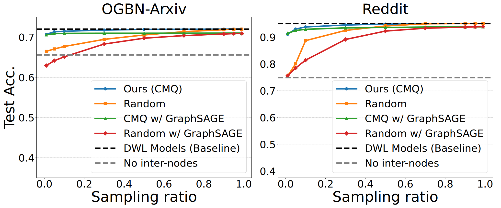
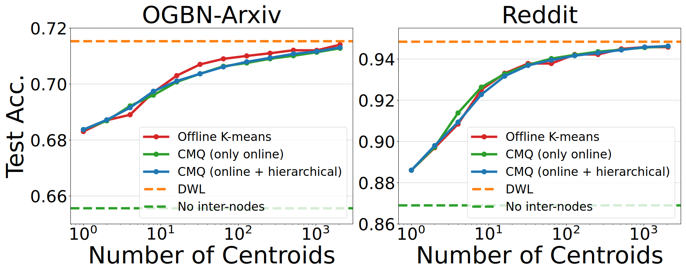
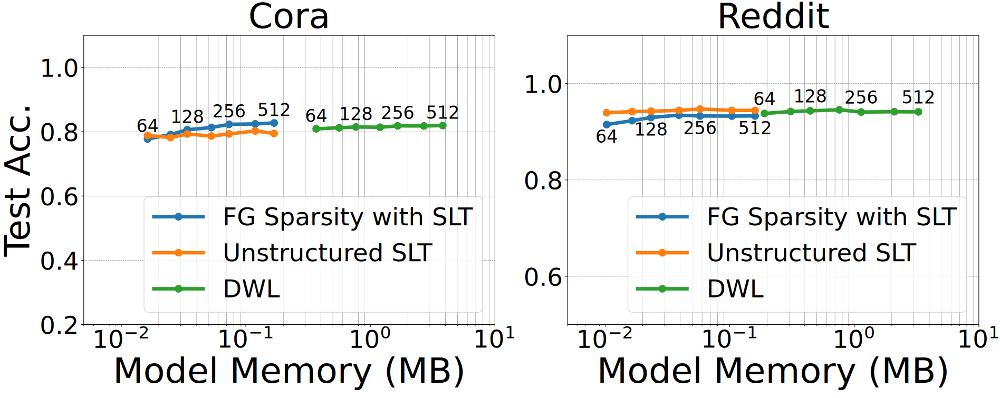
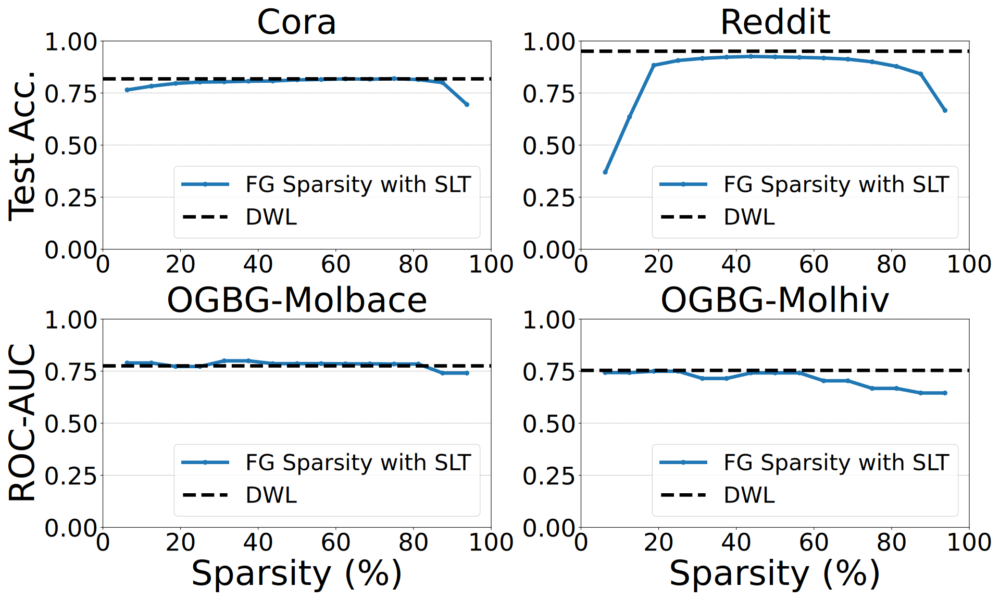

# BingoGCN: Towards Scalable and Efficient GNN Acceleration with Fine-Grained Partitioning and SLT


Jiale Yan, Hiroaki Ito, Yuta Nagahara, Kazushi Kawamura, Masato Motomura, Thiem Van Chu, Daichi Fujiki.

---

## Overview of evalutions

We propose a GCN algorithm and accelerator co-design framework called BingoGCN.

* ***On the algorithm level***, BingoGCN integrates Strong Lottery Tickets (SLT) during the combination stage and introduces Cross-Partition Message Quantization (CMQ) in the aggregation stage to reduce computational overhead. Additionally, graph partitioning algorithms are employed to evaluate the impact of graph structure on performance.

* ***On the hardware level***, BingoGCN features a dedicated accelerator that exploits the sparsity and structure of the graphs produced by the algorithm-level optimizations, thereby further enhancing acceleration efficiency.


<!-- ```bash
# Python and PyTorch versions
Python version: 3.10.8
PyTorch version: 1.13.0+cu117

# Install required packages
pip install pymetis         # For METIS partitioning
pip install torch_geometric # For accessing datasets
``` -->

<!-- This release contains codes focusing on the algorithmic part described in the paper.

> **Offline METIS Graph Partitioning for Fig.1 in the paper.**
> Dataset: OGBN-Arxiv with varying numbers of partitions
> Code location: ./offline-METIS/ -->


# Usage of the Provided Codes

## Environment Setup
```bash
git clone https://github.com/LouiValley/BingoGCN.git
↓
cd BingoGCN
↓
source /opt/conda/bin/activate
↓
conda env create -f env/conda.yml
↓
conda activate BingoGCN
↓
pip install -r env/requirements.txt
```

<!-- # pip install torch==1.13.0+cu116 torchvision==0.14.0+cu116 torchaudio==0.13.0 --extra-index-url https://download.pytorch.org/whl/cu116
# ↓
# pip install \
#   https://data.pyg.org/whl/torch-1.13.0+cu116/torch_scatter-2.1.1%2Bpt113cu116-cp39-cp39-linux_x86_64.whl \
#   https://data.pyg.org/whl/torch-1.13.0+cu116/torch_sparse-0.6.17%2Bpt113cu116-cp39-cp39-linux_x86_64.whl \
#   https://data.pyg.org/whl/torch-1.13.0+cu116/torch_cluster-1.6.1%2Bpt113cu116-cp39-cp39-linux_x86_64.whl \
#   https://data.pyg.org/whl/torch-1.13.0+cu116/torch_spline_conv-1.2.2%2Bpt113cu116-cp39-cp39-linux_x86_64.whl \
#   torch-geometric
# ↓ -->

## Running the Experiments

> ### To experiment with "Ours" only:
```bash
sh scripts/jobs_ours.sh
```
> ### To experiment with "Ours" and small dataset only:
```bash
sh scripts/jobs_ours_light.sh
```
> ### To experiment with all data points:
```bash
sh scripts/jobs_all.sh
```

Removing the --dataset Reddit option will speed up the process.

## Post-Experiment Steps
After all experiments have completed, execute:

```bash
python BingoGCN/log_to_csv.py
```
This script aggregates the results into CSV files within each log folder.

Finally, compare these results with the ones in the expected_results folder.
You can verify that the data points in the figures match, allowing for minor discrepancies.

## Example
> **Centroid (Sampling) Ratio vs. Accuracy: Fig.15

```bash
# Ours (CMQ) - Sampling ratio 1%
python -m BingoGCN.graph_partitioning.main \
    --dataset ogbn-arxiv \
    --inter_cluster \
    --outgoing_kmeans \
    --hierarchical_kmeans \
    --fixed_centroid_ratio \
    --centroid_ratio 0.01 \
    --pretrained_log BingoGCN/pretrained_logs/SLT_structured_Dense_baseline/GCN/ogbn-arxiv/SLT_structured_Dense_baseline_GCN_HD192_ogbn-arxiv_L4_S0.log

# Random - Sampling ratio 1%
python -m BingoGCN.graph_partitioning.main \
    --dataset ogbn-arxiv \
    --inter_cluster \
    --random_sampling \
    --inter_sparsity 0.99 \
    --pretrained_log BingoGCN/pretrained_logs/SLT_structured_Dense_baseline/GCN/ogbn-arxiv/SLT_structured_Dense_baseline_GCN_HD192_ogbn-arxiv_L4_S0.log
```

> **Num of Partitions vs. CMQ's Accuracy with fixed centroid ratio at 1%: Fig.16

```bash
# Ours (CMQ) - #parts=64:
python -m BingoGCN.graph_partitioning.main \
    --dataset ogbn-arxiv \
    --n_parts 64 \
    --validate \
    --inter_cluster \
    --outgoing_kmeans \
    --hierarchical_kmeans \
    --fixed_centroid_ratio \
    --centroid_ratio 0.01 \
    --pretrained_log BingoGCN/pretrained_logs/SLT_structured_Dense_baseline/GCN/ogbn-arxiv/SLT_structured_Dense_baseline_GCN_HD192_ogbn-arxiv_L4_S0.log

# No border nodes - #parts=64:
python -m BingoGCN.graph_partitioning.main \
    --dataset ogbn-arxiv \
    --n_parts 64 \
    --validate \
    --no_inter_cluster \
    --pretrained_log BingoGCN/pretrained_logs/SLT_structured_Dense_baseline/GCN/ogbn-arxiv/SLT_structured_Dense_baseline_GCN_HD192_ogbn-arxiv_L4_S0.log
```

> **Traditional offline K-means vs. CMQ: Fig.17

```bash
# Offline K-means - #Centroids=64:
python -m BingoGCN.graph_partitioning.main \
    --dataset ogbn-arxiv \
    --inter_cluster \
    --outgoing_kmeans \
    --num_kmeans_clusters 64\
    --pretrained_log BingoGCN/pretrained_logs/SLT_structured_Dense_baseline/GCN/ogbn-arxiv/SLT_structured_Dense_baseline_GCN_HD192_ogbn-arxiv_L4_S0.log

# CMQ (only online) - #Centroids=64:
python -m BingoGCN.graph_partitioning.main \
    --dataset ogbn-arxiv \
    --inter_cluster \
    --outgoing_kmeans \
    --online_kmeans \
    --num_kmeans_clusters 64 \
    --pretrained_log BingoGCN/pretrained_logs/SLT_structured_Dense_baseline/GCN/ogbn-arxiv/SLT_structured_Dense_baseline_GCN_HD192_ogbn-arxiv_L4_S0.log

# CMQ (online = hierarchical) - #Centroids=64:
python -m BingoGCN.graph_partitioning.main \
    --dataset ogbn-arxiv \
    --n_parts 8 \
    --inter_cluster \
    --outgoing_kmeans \
    --hierarchical_kmeans \
    --num_kmeans_clusters 64 \
    --pretrained_log BingoGCN/pretrained_logs/SLT_structured_Dense_baseline/GCN/ogbn-arxiv/SLT_structured_Dense_baseline_GCN_HD192_ogbn-arxiv_L4_S0.log
```

> **Weight Capacity vs. Accuracy: Fig.18

```bash
# FG Sparsity with SLT - #dim_hidden=192:
python ./BingoGCN/main.py \
    --command train \
    --num_layers 3 \
    --dim_hidden 192 \
    --dataset Cora \
    --train_mode score_only \
    --exp_name test \
    --epochs 400 \
    --type_model GCN \
    --repeat_times 10 \
    --sparse_decay \
    --init_mode signed_constant_SF \
    --sparsity_list 0.812500 0.875000 0.937500 \
    --linear_sparsity 0.8125 \
    --unstructured_for_last_layer \
    --enable_mask \
    --nmsparsity \
    --M 16 \
    --type_norm None

# Unstructured SLT - #dim_hidden=192:
python ./BingoGCN/main.py \
    --command train \
    --num_layers 3 \
    --dim_hidden 192 \
    --dataset Cora \
    --train_mode score_only \
    --exp_name test \
    --epochs 400 \
    --type_model GCN \
    --repeat_times 5 \
    --sparse_decay \
    --unstructured_for_last_layer \
    --init_mode xor16_offset \
    --sparsity_list 0.800000 0.866667 0.933333 \
    --linear_sparsity 0.8 \
    --enable_mask \
    --type_norm None \

# DWL - #dim_hidden=192:
python ./BingoGCN/main.py \
    --command train \
    --num_layers 3 \
    --dim_hidden 192 \
    --dataset Cora \
    --train_mode normal \
    --exp_name test \
    --epochs 400 \
    --type_model GCN \
    --repeat_times 10 \
    --init_mode kaiming_uniform \
    --linear_sparsity 0 \
    --type_norm None
```

> **Model Sparsity vs. Accuracy: Fig.19

```bash
# FG Sparsity with SLT - Sparsity=50%:
python ./BingoGCN/main.py \
    --command train \
    --num_layers 3 \
    --dim_hidden 192 \
    --dataset Cora \
    --train_mode score_only \
    --exp_name test \
    --epochs 400 \
    --type_model GCN \
    --repeat_times 10 \
    --sparse_decay \
    --init_mode signed_constant_SF \
    --sparsity_list 0.500000 0.666667 0.833333 \
    --linear_sparsity 0.5 \
    --unstructured_for_last_layer \
    --enable_mask \
    --nmsparsity \
    --M 16 \
    --type_norm None \
```
<!--
Supported models
- 3/4 layer GCNs with 192 hidden dimensions.

Supported datasets
How to change the dataset "XXXX change path = load_dir"
- Cora
- CiteSeer
- Pubmed
- OGBN-Arxiv
- OGBN-Reddit
- Other graph-level tasks.
 -->
